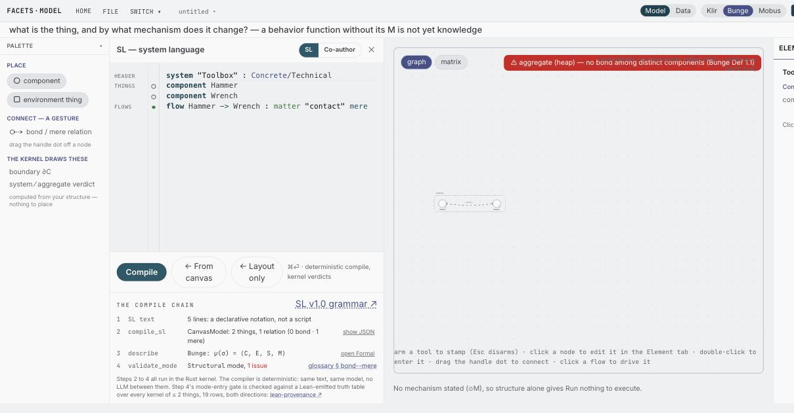
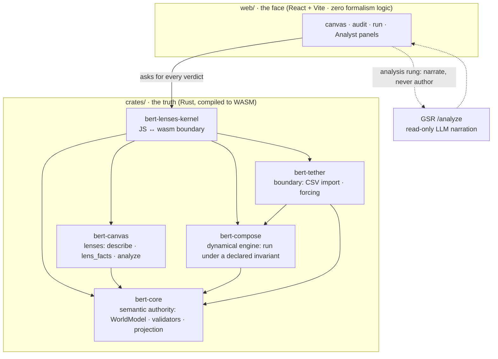

# bert-lenses

**Describe a system — draw it on a canvas, write it in SL, or draft it with an
LLM. A formal kernel then judges whether what you described holds as a *system*,
and cites the rule when it doesn't.**

[](LICENSE)
[](https://github.com/halcyonic-systems/bert-lenses/actions/workflows/ci.yml)
[](https://github.com/halcyonic-systems/bert-lenses/actions/workflows/wasm-exec.yml)
[](https://github.com/halcyonic-systems/bert-lenses/actions/workflows/lean-provenance.yml)

<!-- SCREENSHOT SLOT (#252) ────────────────────────────────────────────────
     One image, here: a refusal on screen in the verdict panel, with the model
     that provoked it visible beside it. The prose below stands alone without
     it — the image is the proof that this is a running tool, not a claim the
     reader has to take on faith.

     Capture procedure: .claude/docs/desktop-app-automation.md

     
──────────────────────────────────────────────────────────────────────── -->

Modeling tools render what you author. This one also **judges** it: once a model
exists, the kernel decides whether it holds as a system under three traditions of
systems science — Klir, Bunge, and Mobus — and every verdict names the condition
it rests on. Where a model holds, it runs against your own data.

Three ways in, one model underneath — and the LLM path runs *through* SL rather
than around it. A draft is text the same deterministic compiler reads, and you
accept or discard it. No generated text reaches a verdict.

```
  you author                                          you get back
  ──────────                                          ────────────

  canvas ─────┐
              │                                  ┌──▶  verdict
  SL text ────┼──▶  crates/ · Rust → WASM  ──────┤     cites the rule
              │     owns every verdict,          │
  LLM draft ──┘     all validation, the run      └──▶  run
   (writes SL)                                          under a declared
                    web/ renders it. Nothing more.      invariant
```

`crates/` is truth, `web/` is face, and any systems logic in JS is a bug.

## Try it

There is no hosted instance to click today: this repo is the whole distribution,
so running it means cloning it. That is the honest floor, and it is a short one —
the only tool you install by hand is `just`, because nothing in the repo can
check for `just` itself.

```bash
brew install just     # sudo apt install just · cargo install just also fine
just preflight        # names anything else that is missing, with the install line
just dev              # builds the wasm kernel, installs web deps, opens the app
```

About forty seconds from a cold clone to a running instrument; the full
prerequisite table is under [Prerequisites](#prerequisites). Then take the
[**ten-minute quickstart**](docs/quickstart.md): author a model, read its
verdicts, break it on purpose, fix what the refusal names, and open one that runs
against real data.

## See it refuse

The whole claim in one exchange. Four lines of SL — two things and a relation
between them, declared `mere`: a relation that holds but does not act.

```
system "Toolbox" : Concrete/Technical
component Hammer
component Wrench
flow Hammer -> Wrench : matter "contact" mere
```

Read through **Klir**, that is a system: two things, one relation — `S = (T, R)`
with both coordinates populated. Switch to the **Bunge** lens and the kernel
refuses the same model:

```
mode/Structural · error
  Bunge Def 1.1: a system requires at least one bond between distinct
  components; an unbonded collection is an aggregate
  fix: Add an interaction between two distinct systems, or author in Core mode
  see: docs/glossary.md#bond--mere
```

Not a lint warning and not a style note. A verdict, naming the definition it
rests on and the edit that clears it. Every refusal in the tool carries those
four things: where, what rule, what repair, what to read.

The disagreement is the point, and it is not a matter of strictness. Klir counts
the relation because Klir counts relations. Bunge does not, because `mere` says
this relation is not a *bond* — and Bunge's system is defined by bondage, so an
unbonded collection is an aggregate. Drop the word `mere` and the same four lines
pass both lenses. That distinction is Bunge's own contribution, and the kernel
holds you to it.

That exchange is pinned by a test — if the kernel stops refusing this model, or
stops citing that definition, the build fails
([`crates/bert-canvas/tests/readme_claims.rs`](crates/bert-canvas/tests/readme_claims.rs)).
A claim on a front page is a claim like any other.

## Reading a verdict

**Judge.** The kernel is a decision procedure, not a renderer. It answers one
question — *may this be authored as a system under this lens?* — and it can
answer no. When it does it stops: it never guesses what you meant, silently drops
structure it cannot place, or repairs your model on your behalf.

**Precondition.** Each lens is entered through one named formal condition, and
refusals name it. Bunge's is `HasBond` — at least one bond between distinct
components. Mobus's is `Irreflexive` — no interaction depends on itself. Those
conditions are defined in Lean 4, in a separate repository pinned by commit and
re-resolved in CI, and every claim this repo makes about them cites a `claim_id`
rather than a line number, so you can audit the theory instead of trusting it.

What is proven, stated exactly: `toKlir` holds unconditionally; `toBunge` and
`toMobus` sit behind those two preconditions and **neither entails the other**:
the lenses are parallel, and satisfying one implies nothing about the others.
One composite is proven, `toMobus_toBunge`. Some invariants are machine-*tested* rather than Lean-proven;
which ones is in [`docs/theory-fidelity.md`](docs/theory-fidelity.md).

**Lens.** A tradition's reading of your model, generated by the kernel rather
than styled on top of it. Author once, read it as any of the three, each in its
own vocabulary — every word's lineage cited in the
[terminology concordance](docs/language/terminology-concordance.md). The lens is also the commitment being
checked: a model that is fine as Klir can be refused as Bunge, and that
disagreement is information about your model.

## Where to start

| You are here to… | Start at | Then |
|---|---|---|
| **model something** — a supply chain, a protocol, a cell, an org | [`docs/quickstart.md`](docs/quickstart.md) | [`docs/tour.md`](docs/tour.md), one model grown line by line |
| **author a model that RUNS** — dynamics, forcing, the gallery | [`docs/authoring-models.md`](docs/authoring-models.md) — the `.sl` → mint → bundle loop, and the five facts that bite | [`assets/examples/watershed.sl`](assets/examples/watershed.sl), the smallest runnable source |
| **assess the theory** — alone, with an expert, or with an LLM | [`docs/theory-fidelity.md`](docs/theory-fidelity.md) — take/drop/why per tradition | [`docs/lean-provenance.md`](docs/lean-provenance.md) for the pinned commit and the per-claim map |
| **read the language** | [`docs/language/`](docs/language/) — spec, corpus, lineage | the [concordance](docs/language/terminology-concordance.md): every word's lineage cited |
| **work on the code** | [`CLAUDE.md`](CLAUDE.md) — invariants and the crate layout | [`crates/bert-lenses-kernel/API.md`](crates/bert-lenses-kernel/API.md), the frozen JS↔wasm surface |

No systems-science background is needed for the first row: each lens's palette
carries its tradition's vocabulary as you author, so you pick it up in place.
More deliberate failures to learn from are in
[`fixtures/sl/teaching/`](fixtures/sl/teaching/), where two of the four files do
not compile, on purpose. [`docs/README.md`](docs/README.md) indexes everything
else, status-marked.

## What this tool believes

**The three lenses are generated, not opinions.** Klir, Bunge, and Mobus are
three faithful views the K ≅ **2** kernel *generates* from one model. What is
actually proven, graduated honestly:

- **Klir is unconditional.** `toKlir` holds for every kernel — no precondition.
- **Bunge and Mobus each sit behind an independent machine-checked precondition.**
  `toBunge` requires `HasBond`, `toMobus` requires `Irreflexive`; neither entails
  the other, and there is no proven entailment between them.
- **One composite path is proven.** `toMobus_toBunge` is the single proven
  composite: when both preconditions hold, Mobus-then-Bunge factors through Klir.

The maps all live in `Klir/ViewGeneration.lean` (despite the filename).
`describe(model, lens)` hands the model back in each lens's own vocabulary — its
counts-hold invariant is **machine-tested at runtime**, not Lean-proven. The
canonical scope of what's proven vs tested is
[`docs/theory-fidelity.md`](docs/theory-fidelity.md).

**One dynamics-kind, and it says so.** Where a model holds, you can run it: a
deterministic run under a model-declared invariant, driven by your own data. The
current engine implements exactly one dynamics-kind — an Id-functor over ℝⁿ
stocks with an additive conservation invariant — and further kinds are
*declarable*, not implemented. Conservation is a property the model declares, not
one the engine assumes; the position of record is
[`docs/design/dynamics-principled-position.md`](docs/design/dynamics-principled-position.md).
Time is honest too (#258/#259): rates are per unit time, **wires transmit and
stocks remember** — a memoryless process relays within the step, memory lives
only in declared stocks, and a loop with neither is refused by name rather than
silently delayed. A run is therefore Δt-invariant over a fixed horizon
(`dt_invariance.rs` holds it; the mutation harness proves the gate can fail),
and refining a diagram — one relay into two — never changes its behavior.

**A lens is a commitment the kernel checks.** Klir asks only for
things-in-relation. Bunge demands a bond between distinct components, or refuses
the model as an aggregate. Mobus demands no self-dependency. The three are
independent — a lattice of parallel lenses, not a linear tower. Satisfying one
lens implies nothing about the others.

**Save ≠ Export.** *Save* keeps your working canvas state, the shape you're
mid-authoring. *Export* writes a mode-stamped `WorldModel`: what you're
asserting is true as of this lens, and the artifact other tools consume. (A run
also computes a conservation ledger, but that's a result shown in the run panel,
not a saved tier.)

**Refusals cite a precondition, not a shrug.** The kernel errors loudly rather
than silently dropping or guessing at authored structure — every refusal points
at a specific formal precondition you can look up.

**One model, three surfaces.** Canvas gestures, SL text, and JSON are three
concrete syntaxes over one neutral spec — none of them the source of truth; the
neutral spec is. SL's parser judges no systemhood: legality stays the kernel's
verdict, reached the same way canvas gestures reach it. Specification, corpus,
and reading order: [`docs/language/`](docs/language/).

## Structure



The crate layout on disk:

```
crates/                     # TRUTH — the kernel, self-contained + wasm-ready
  bert-core/                #   semantic authority: WorldModel, validators, projection
  bert-compose/             #   executable dynamical engine: circuit / export / run
  bert-canvas/              #   canvas/lens domain: CanvasModel, lens_facts, describe
  bert-tether/              #   boundary interface: CSV import, run manifest, forcing
  bert-lenses-kernel/       #   JS-facing wasm-bindgen boundary (marshaling only)
  bert-cli/                 #   the `bert` binary: the same truth, from a shell (native only)
web/                        # FACE — React 19 + TS + Vite 6 + Tailwind 4 (Halcyonic Frost)
src-tauri/                  # the macOS host: the same web/dist in a window (own workspace)
fixtures/                   # serde↔TS contract goldens (fixtures/contract/)
  sl/                       #   SL corpus: spec examples = round-trip goldens = teaching set
  sl/teaching/              #   the graded teaching set, including two files that fail on purpose
docs/                       # see docs/README.md for the indexed tour
  language/                 #   SL — the system language: spec, corpus, lineage
  design/                   #   research foundations + design positions
  decisions/                #   ADRs
  archive/                  #   superseded, kept as record
spec/                       # the lens-entry spec the kernel's mode entry implements
scripts/                    # gate + build tooling: doc_lint.py (the first step of `just check`),
                            #   lean_provenance.py, wasm_exec.mjs, packaging helpers
assets/models/              # sample BERT models (demos + blockchain examples)
assets/demos/               # run bundles: the model + CSV + mapping a runnable example ships
assets/examples/            # the structural examples (.sl) the library shelves are built from
assets/corpus/              # models transcribed from the founding texts, each with its citation
assets/fonts/               # STIX fonts for the formal face
examples/                   # sample input data (the LLM-market CSV some demos are shaped around)
launchd/                    # OPTIONAL macOS agent that keeps the app running (docs/running-permanently.md)
pipeline/                   # OPTIONAL Python data-prep — off the product path, not in CI
```

`bert-core`, `bert-compose`, `bert-canvas`, and `bert-tether` are **vendored**
(self-contained, no cross-repo path deps). The `bert-compose` copy is engine-only:
the native egui shell it had upstream is dropped, so it carries no native
dependency and compiles clean to `wasm32-unknown-unknown`. Node geometry uses
`glam::Vec2` in place of `egui::Pos2`, so the engine pulls in no UI crate at all.

`pipeline/` produces the LLM-market panel CSVs some demos are shaped around. It has
its own venv and README and is **not** load-bearing for the product or the gates.

## Prerequisites

Every command below is a `just` recipe, so **`just` itself is the one thing you
install by hand** — nothing in this repo can check for it:

```bash
brew install just          # macOS
# Debian/Ubuntu: sudo apt install just   ·   anywhere with Rust: cargo install just
```

Then let the repo tell you what else is missing:

```bash
just preflight             # checks each prerequisite, prints the install line for whatever is absent
```

What it checks, and why each one is needed:

| Tool | Needed by | If missing |
|---|---|---|
| **python3** | `scripts/doc_lint.py`, the **first** step of `just check` | macOS: `xcode-select --install` · Debian/Ubuntu: `sudo apt install python3` |
| **Rust (stable) + rustup** | the kernel | `curl --proto '=https' --tlsv1.2 -sSf https://sh.rustup.rs \| sh` |
| **`wasm32-unknown-unknown` + clippy** | the browser build and the `-D warnings` gate | installed for you — [`rust-toolchain.toml`](rust-toolchain.toml) declares both |
| **wasm-pack** | building the pkg `web/` imports | `cargo install wasm-pack` (or `brew install wasm-pack`) |
| **Node ≥ 22** | the web face; the floor is pinned in [`.nvmrc`](.nvmrc) | `nvm install` (reads `.nvmrc`) or `brew install node` |
| **web dependencies** | everything under `web/` | installed for you — `just dev` and `just check` both run `npm ci` on a cold clone |
| **cargo-tauri** | `just desktop` **only** | `cargo install tauri-cli --version "^2"` |

Rust is pinned to `stable`, matching CI (`dtolnay/rust-toolchain@stable`); no
lower floor is tested. Nightly work such as fuzzing overrides the pin the normal
way, with `cargo +nightly`.

With `just` installed and `just preflight` clean, `just dev` works from a fresh
clone with no further setup.

## Develop

The `justfile` is the entry point. Rust is the brain (wasm), `web/` is the face; a
crate change must never silently serve stale wasm.

There's no back end and no IPC: the kernel runs synchronously in the browser tab
(wasm-bindgen), so bert-lenses runs in a browser, on mobile, and inside
Claude-in-Chrome. `src-tauri/` hosts the *same* `web/dist` as a macOS app — a
window, no second code path.

```bash
just preflight  # check the prerequisites above, and name what is missing
just wasm       # rebuild the wasm pkg the web app consumes (run after any crate change)
just dev        # install web deps if needed, rebuild wasm, start the vite dev server
just bert ARGS  # the headless CLI — ask the kernel about a model without a browser
just check      # the full gate suite — CI parity
just desktop    # bundle the macOS .app (docs/running-permanently.md)
```

`just check` is the full local gate, in CI's order: **`python3 scripts/doc_lint.py`**
(the reason `python3` is a prerequisite — it is the first step, not an optional
extra), `cargo test --workspace`, `cargo clippy -D warnings`, the
`wasm32-unknown-unknown` build, the wasm pkg build, then `check:tokens`,
`tsc --noEmit`, `vitest`, `vite build`, and `just wasm-exec`.

**A green run means more than "it compiled."** It also means no doc is
unreachable, no relative link is broken, every doc declares exactly one status,
no Lean citation has gone stale at the pinned commit, and the wasm boundary
still does what the contract fixtures say. The full table is in
[`CONTRIBUTING.md`](CONTRIBUTING.md#definition-of-done).

**Two gates run in CI only** — the macOS bundle (`desktop.yml`) and licence +
advisory checking (`deny.yml`) — because they need macOS and a network advisory
database respectively.

`just dev` and `just check` both run `npm ci` in `web/` when `node_modules` is
absent, so neither needs a separate install step on a cold clone.

<details>
<summary>Manual commands (what the recipes wrap)</summary>

```bash
cd crates/bert-lenses-kernel
wasm-pack build --target web --out-dir pkg --dev     # --release for the shipped bundle
cd ../../web && npm ci && npm run dev                 # prints the URL; 5173 unless taken
cargo test --workspace
cargo build --workspace --target wasm32-unknown-unknown
python3 scripts/doc_lint.py
```
</details>

## The `bert` CLI — the same kernel, from a shell

Every verdict the app shows is a library call, and until #315 the only door onto
those calls was a browser. `bert` is the door. It decides nothing: it parses
arguments, calls `bert-canvas` / `bert-core` / `bert-compose`, and prints what
comes back. A verdict computed in the CLI would be the same bug as a verdict
computed in JS.

```bash
just bert verdict assets/examples/watershed.sl        # via cargo, no install
cargo install --path crates/bert-cli                  # or put `bert` on PATH
```

```
bert compile  <file.sl>                 the canvas model the text becomes
bert verdict  <file> [--lens L]         what the kernel says; exits 4 on a refusal
bert describe <file> [--lens L]         the formal object the tradition writes
bert run      <file> [--t T] [--dt D]   the trajectory, or why there is none
bert layout   <file>                    where the nodes sit
```

A file argument is a path or `-` for stdin. `.sl` compiles; anything else opens
as a stored model — neutral archive or legacy `WorldModel`, shape decides, the
same `archive::read` the app uses. For stdin the first non-blank character
decides.

**stdout carries JSON and only JSON**, so a pipeline never has to skip a banner
line; human diagnostics (line-anchored parse faults, the refusal summary) go to
stderr. The shapes are the kernel's own serde types, the same ones
[`API.md`](crates/bert-lenses-kernel/API.md) documents: `compile` prints a
`CanvasModel`, `verdict` a `CanvasAnalysis`, `describe` a `LensDescription`,
`run` a `RunResult`. `layout` is the one CLI-shaped answer — a straight
selection of `id`/`name`/`role`/`env_kind`/`x`/`y` off the model, no derivation.

**The exit code carries the kind of failure**, so a check branches without
parsing anything:

| Code | Meaning |
|---|---|
| `0` | the answer is on stdout |
| `1` | internal — the answer could not be written |
| `2` | usage — bad arguments (clap's own) |
| `3` | the input did not compile, or is not a model file |
| `4` | the kernel refused: a validation error at the lens's mode, no executable projection, or a run with no step |

The split between 3 and 4 is the one that matters: a mistyped keyword and a
model that is not a system are different findings.

**`--lens` is the point.** `lenses::analyze` takes the lens as an explicit
argument and **ignores `model.lens`**, so the CLI can read a model under a
tradition it was never pinned to. The corpus's one documented divergence is a
two-line shell check:

```bash
bert verdict assets/corpus/bunge/coupling-sigma3.sl --lens bunge   # 0 — legal Bunge structure
bert verdict assets/corpus/bunge/coupling-sigma3.sl --lens mobus   # 4 — Mobus §4.3 forbids the diagonal
```

And the layout regression that cost a browser-JavaScript measurement session on
2026-08-12 is one line:

```bash
bert layout assets/examples/watershed.sl \
  | jq '[.nodes[] | select(.env_kind=="Source") | .x] | max
        < ([.nodes[] | select(.env_kind=="Sink") | .x] | min)'
```

`fixtures/cli/examples.json` is a golden reading of every bundled example
through this door — what it compiles to, its error count under **each** of the
three lenses, whether it runs, and where its nodes sit. Regenerate with
`BLESS_CLI_GOLDEN=1 cargo test -p bert-cli` and read the diff: an unexplained
row change is the finding.

`bert-cli` is the one package excluded from the workspace `wasm32-unknown-unknown`
build (`--exclude bert-cli` in `justfile` and `ci.yml`) — a native binary of argv
and the filesystem has nothing to do in a browser. The exclusion is *checked*,
not merely commented: `crates/bert-cli/tests/wasm_gate.rs` fails if the list ever
grows, so the wasm gate cannot quietly widen into one that skips things.

## Where to look

**[`docs/README.md`](docs/README.md) is the index** — every document under
`docs/` and `spec/`, status-marked (LIVE · ADOPTED · PROPOSED · CONTINGENT(#N) ·
RESEARCH · HISTORICAL) and grouped by what it is for. Start there to find
anything.

This list used to restate a dozen of those entries, and by 2026-07-26 the two had
drifted four days apart. There is one index; three pointers live here because they
are not under `docs/`:

- [`CLAUDE.md`](CLAUDE.md) — the agent runbook: invariants, the 5-crate layout,
  working rules, and the 8-step palette-extension procedure.
- [`crates/bert-lenses-kernel/API.md`](crates/bert-lenses-kernel/API.md) — the
  frozen JS↔wasm surface (append-only).
- [`web/DESIGN.md`](web/DESIGN.md) — Halcyonic Frost design tokens for the face,
  and the one owner of the design system.

**Forward-looking work → the [roadmap board](https://github.com/orgs/halcyonic-systems/projects/12)**,
organized by epic. The old `ROADMAP.md` is retired to
[`docs/archive/roadmap-pre-web-rebuild.md`](docs/archive/roadmap-pre-web-rebuild.md);
work that was decided and deliberately not scheduled is in
[`docs/parked.md`](docs/parked.md); what the instrument is *for* lives in "What
this tool believes" above.

## Status

Rebuilt web-first (egui → React); the kernel + engine are consolidated here and
wasm-ready. The per-lens authoring work (Phase 4) is in progress, and the
read-only LLM analysis rung shipped 2026-07-17 (deterministic #66 graph checks +
an Analyst panel that narrates kernel facts through GSR, read-only). The prior
egui app lives on the `pre-web-rebuild` tag / `archive/egui-app` branch.

**Live status and roadmap → [bert-lenses Roadmap board](https://github.com/orgs/halcyonic-systems/projects/12).**

The instrument is one of the two faces of the K≅2 kernel: the *structural* face
(author/validate) and the *dynamical* face (`bert-compose`, run), united here in
one self-contained tool.
