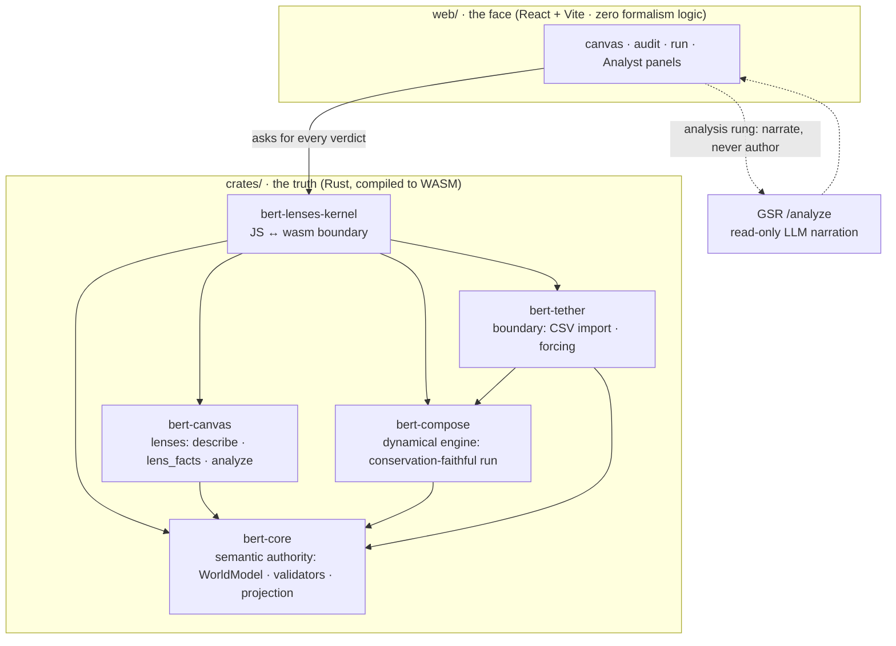

# bert-lenses

bert-lenses is a web-first instrument for modeling systems. You author a system
as things and the relations between them, and a formal kernel checks your
model — deciding whether it holds as a *system* under each of three traditions
(Klir, Bunge, Mobus) and, where it does, simulating it.

**Rust is the brain, React is the face.** The kernel is Rust compiled to
WebAssembly, and it owns all the formalism: every systemhood verdict, all
validation, the conservation-faithful simulation. The web layer renders what
the kernel decides and nothing more. `crates/` = truth · `web/` = face; any
systems logic in JS is a bug.

## What this tool believes

**The three lenses are generated, not opinions.** Klir, Bunge, and Mobus are
three faithful views the K ≅ **2** kernel *generates* from one model, each
licensed by its own machine-checked precondition (proven in
`Klir/ViewGeneration.lean`). `describe(model, lens)` hands the model back in
each lens's own vocabulary — counts hold, words change, and that invariant is
machine-tested.

**A lens is a commitment the kernel checks.** Klir asks only for
things-in-relation. Bunge demands a bond between distinct components, or refuses
the model as an aggregate. Mobus demands no self-dependency. The three are
independent — a lattice, not a ladder.

**Save ≠ Export.** *Save* keeps your working canvas state, the shape you're
mid-authoring. *Export* writes a mode-stamped `WorldModel`: what you're
asserting is true as of this lens, and the artifact other tools consume. (A run
also computes a conservation ledger, but that's a result shown in the run panel,
not a saved tier.)

**Refusals cite a precondition, not a shrug.** The kernel errors loudly rather
than silently dropping or guessing at authored structure — every refusal points
at a specific formal precondition you can look up.

**Who this is for.** Someone already convinced the tool is worth using, who now
wants to assess the quality of the theory underneath it, on their own or with
help from an LLM or another expert. Likely an engineer, scientist, or
mathematician, and often someone with a systems or complexity background, though
neither is required.

The full, cited version of everything above is
[`docs/theory-fidelity.md`](docs/theory-fidelity.md); [`docs/README.md`](docs/README.md)
indexes the rest.

## Structure



The crate layout on disk:

```
crates/                     # TRUTH — the kernel, self-contained + wasm-ready
  bert-core/                #   semantic authority: WorldModel, validators, projection
  bert-compose/             #   executable dynamical engine: circuit / export / run
  bert-canvas/              #   canvas/lens domain: CanvasModel, lens_facts, describe
  bert-tether/              #   boundary interface: CSV import, run manifest, forcing
  bert-lenses-kernel/       #   JS-facing wasm-bindgen boundary (marshaling only)
web/                        # FACE — React 19 + TS + Vite 6 + Tailwind 4 (Halcyonic Frost)
fixtures/                   # serde↔TS contract goldens (fixtures/contract/)
docs/                       # design + architecture docs (see docs/design/, docs/archive/)
assets/models/              # sample BERT models (demos + blockchain examples)
assets/fonts/               # STIX fonts for the formal face
pipeline/                   # OPTIONAL Python data-prep — off the product path, not in CI
```

`bert-core`, `bert-compose`, `bert-canvas`, and `bert-tether` are **vendored**
(self-contained, no cross-repo path deps). The `bert-compose` copy is engine-only:
the native egui shell it had upstream is dropped, so it carries no native
dependency and compiles clean to `wasm32-unknown-unknown`. Node geometry uses
`glam::Vec2` in place of `egui::Pos2`, so the engine pulls in no UI crate at all.

`pipeline/` produces the LLM-market panel CSVs some demos are shaped around. It has
its own venv and README and is **not** load-bearing for the product or the gates.

## Develop

The `justfile` is the entry point. Rust is the brain (wasm), `web/` is the face; a
crate change must never silently serve stale wasm.

There's no back end and no IPC: the kernel runs synchronously in the browser tab
(wasm-bindgen), so bert-lenses runs in a browser, on mobile, and inside
Claude-in-Chrome. An optional Tauri wrapper can later host the *same* web app
natively.

```bash
just wasm     # rebuild the wasm pkg the web app consumes (run after any crate change)
just dev      # rebuild wasm, then start the vite dev server (face sees fresh brain)
just check    # the full gate suite — CI parity
```

`just check` runs exactly what CI enforces (`.github/workflows/ci.yml`): `cargo
test --workspace`, `cargo clippy -D warnings`, the `wasm32-unknown-unknown` build,
the wasm pkg build, then `tsc --noEmit`, `vitest`, `check:tokens`, and `vite build`
in `web/`.

<details>
<summary>Manual commands (what the recipes wrap)</summary>

```bash
cd crates/bert-lenses-kernel
wasm-pack build --target web --out-dir pkg --dev     # --release for the shipped bundle
cd ../../web && npm install && npm run dev            # http://localhost:5173
cargo test --workspace
cargo build --workspace --target wasm32-unknown-unknown
```
</details>

## Where to look

- [`CLAUDE.md`](CLAUDE.md) — the agent runbook: invariants, the 5-crate layout,
  working rules, and the 8-step palette-extension procedure. Start here.
- [`crates/bert-lenses-kernel/API.md`](crates/bert-lenses-kernel/API.md) — the
  frozen JS↔wasm surface (append-only).
- [`docs/kernel-architecture.md`](docs/kernel-architecture.md) — what the kernel
  *is* as a system: what `describe`/`lens_facts`/`validate_mode`/`analyze` actually
  compute, verified against source with confidence ratings. Read before trusting
  the substrate.
- [`docs/theory-fidelity.md`](docs/theory-fidelity.md) — per-tradition
  (Klir/Bunge/Mobus) take/drop/where/why, mode-stamp semantics, and the
  perspectival-realist scope statement. Start here if you're assessing the
  theory, not just the tool.
- [`docs/on-the-word-ladder.md`](docs/on-the-word-ladder.md) — the three
  distinct senses of "ladder/rung" in this repo's docs and code, and which one
  is the actual vocabulary debt.
- [`docs/README.md`](docs/README.md) — index of the full docs/ folder.
- [`docs/design/llm-integration-research.md`](docs/design/llm-integration-research.md)
  — research foundation for LLM context/authoring/analysis (rests on the kernel
  above); the read-only analysis rung it specified shipped 2026-07-17.
- [`docs/design/lens-palettes.md`](docs/design/lens-palettes.md) — the lens
  grounding for Phase 3/4 (Klir / Bunge / Mobus).
- [`web/DESIGN.md`](web/DESIGN.md) — Halcyonic Frost design tokens for the face.
- [`ROADMAP.md`](ROADMAP.md) — history (predates the web rebuild; see the
  [project board](https://github.com/orgs/halcyonic-systems/projects/12) for
  current status).

## Status

Rebuilt web-first (egui → React); the kernel + engine are consolidated here and
wasm-ready. The per-lens authoring work (Phase 4) is in progress, and the
read-only LLM analysis rung shipped 2026-07-17 (deterministic #66 graph checks +
an Analyst panel that narrates kernel facts through GSR, read-only). The prior
egui app lives on the `pre-web-rebuild` tag / `archive/egui-app` branch.

**Live status and roadmap → [bert-lenses Roadmap board](https://github.com/orgs/halcyonic-systems/projects/12).**

The instrument is one of the two faces of the K≅2 kernel: the *structural* face
(author/validate) and the *dynamical* face (`bert-compose`, run), united here in
one self-contained tool.
