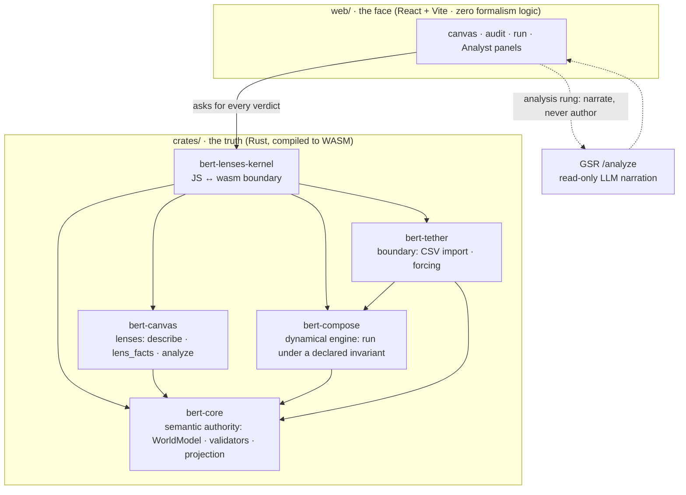

# bert-lenses

**Draw a system, or write it. The kernel tells you whether it *is* one — and cites the rule if it isn't.**

[](LICENSE)
[](https://github.com/halcyonic-systems/bert-lenses/actions/workflows/ci.yml)
[](https://github.com/halcyonic-systems/bert-lenses/actions/workflows/wasm-exec.yml)
[](https://github.com/halcyonic-systems/bert-lenses/actions/workflows/lean-provenance.yml)

<!-- SCREENSHOT SLOT (#252) ────────────────────────────────────────────────
     One image goes here, above the fold, before any prose a reader must
     parse. It should show the thing no other modeling tool does: a REFUSAL
     on screen, with the precondition it cites.

     Not yet inserted — which model and which refusal to show is a judgment
     call about what the tool is for, and that is the decision this whole
     issue exists to get right. Capture procedure:
     .claude/docs/desktop-app-automation.md

     
──────────────────────────────────────────────────────────────────────── -->

Most modeling tools render what you draw. This one **judges** it: it decides
whether what you described actually holds as a *system* under three traditions of
systems science — Klir, Bunge, and Mobus — and every verdict cites the
precondition it rests on. Where a model holds, you can run it against your own
data.

The theory underneath is machine-checked in Lean 4, pinned by commit, and gated
in CI. You can audit it rather than trust it.

## Try it

```bash
brew install just     # the one thing you install by hand (apt / cargo also fine)
just preflight        # names anything else that is missing, with the install line
just dev              # builds the wasm kernel, installs web deps, opens the app
```

From a cold clone that is about 40 seconds to a running instrument. Full
prerequisite table and the manual commands are under
[Prerequisites](#prerequisites).

Then take the [**ten-minute quickstart**](docs/quickstart.md): author a model,
provoke a refusal on purpose, read what comes back, and run a model over real
data.

## What it looks like in text

You describe a system by drawing it on a canvas, or by writing it in SL — a
small, line-oriented language that compiles deterministically:

```
system : Concrete
component "Process M" primitive Combining interface
source "Source 1"
sink "Sink 5"
flow "Source 1" -> "Process M" : matter "material A"
flow "Process M" -> "Sink 5" : matter "product Z"
```

*(an excerpt of [`fixtures/sl/process-m.sl`](fixtures/sl/process-m.sl) — Mobus's
own textbook system paragraph, written in SL)*

## Who this is for

**The newcomer** — anyone who wants to describe a system (a supply chain, a
protocol, a cell, an organization), find out whether what they described actually
*is* one, and watch it run. Start with the
[quickstart](docs/quickstart.md). No systems-science background needed: each
lens's palette carries its tradition's own vocabulary as you author, so you pick
it up in place.

**The auditor** — someone assessing the quality of the theory underneath, alone
or with an LLM or another expert. Start with
[`docs/theory-fidelity.md`](docs/theory-fidelity.md), then the
[terminology concordance](docs/language/terminology-concordance.md) for the cited
Klir·Bunge·Mobus lineage of every word. Every claim about the Lean cites a
`claim_id` resolved against a pinned commit — see
[`docs/lean-provenance.md`](docs/lean-provenance.md).

Either path can stop here. What follows is what the tool believes, then its
mechanics. [`docs/README.md`](docs/README.md) indexes everything else.

## Three things make it unlike other modeling tools

- **One model, three lenses.** Klir, Bunge, and Mobus are not styles or skins —
  they are three mathematically faithful views the kernel *generates* from one
  neutral model, each entered through its own machine-checked precondition.
  Author once; read it as any tradition.
- **A language, not just a canvas.** SL is human-writable and compiles
  deterministically — a compiler, never an LLM. Its lexicon is drawn from the
  traditions themselves (`component` is Bunge's word *and* Mobus's; `mere` is
  Bunge's alone; the flow kinds are Bunge verbatim), with every word's lineage
  cited in the
  [terminology concordance](docs/language/terminology-concordance.md). Text and
  canvas round-trip through the same model; neither is privileged.
- **The theory is checkable.** The kernel's core is grounded in machine-checked
  Lean 4 proofs, and the tool refuses loudly with a citable reason rather than
  guessing. You can audit the theory under the instrument, not just trust it.

**Rust is the brain, React is the face.** The kernel is Rust compiled to
WebAssembly, and it owns all the formalism: every systemhood verdict, all
validation, the dynamics run under its declared invariant. The web layer renders
what the kernel decides and nothing more. `crates/` = truth · `web/` = face; any
systems logic in JS is a bug.

## What this tool believes

**The three lenses are generated, not opinions.** Klir, Bunge, and Mobus are
three faithful views the K ≅ **2** kernel *generates* from one model. What is
actually proven, graduated honestly:

- **Klir is unconditional.** `toKlir` holds for every kernel — no precondition.
- **Bunge and Mobus each sit behind an independent machine-checked precondition.**
  `toBunge` requires `HasBond`, `toMobus` requires `Irreflexive`; neither entails
  the other, and there is no proven entailment between them.
- **One composite path is proven.** `toMobus_toBunge` is the single proven
  composite: when both preconditions hold, Mobus-then-Bunge factors through Klir.

The maps all live in `Klir/ViewGeneration.lean` (despite the filename).
`describe(model, lens)` hands the model back in each lens's own vocabulary — its
counts-hold invariant is **machine-tested at runtime**, not Lean-proven. The
canonical scope of what's proven vs tested is
[`docs/theory-fidelity.md`](docs/theory-fidelity.md).

**One dynamics-kind, and it says so.** Where a model holds, you can run it: a
deterministic run under a model-declared invariant, driven by your own data. The
current engine implements exactly one dynamics-kind — an Id-functor over ℝⁿ
stocks with an additive conservation invariant — and further kinds are
*declarable*, not implemented. Conservation is a property the model declares, not
one the engine assumes; the position of record is
[`docs/design/dynamics-principled-position.md`](docs/design/dynamics-principled-position.md).

**A lens is a commitment the kernel checks.** Klir asks only for
things-in-relation. Bunge demands a bond between distinct components, or refuses
the model as an aggregate. Mobus demands no self-dependency. The three are
independent — a lattice of parallel lenses, not a linear tower. Satisfying one
lens implies nothing about the others.

**Save ≠ Export.** *Save* keeps your working canvas state, the shape you're
mid-authoring. *Export* writes a mode-stamped `WorldModel`: what you're
asserting is true as of this lens, and the artifact other tools consume. (A run
also computes a conservation ledger, but that's a result shown in the run panel,
not a saved tier.)

**Refusals cite a precondition, not a shrug.** The kernel errors loudly rather
than silently dropping or guessing at authored structure — every refusal points
at a specific formal precondition you can look up.

**One model, three surfaces.** Canvas gestures, SL text, and JSON are three
concrete syntaxes over one neutral spec — none of them the source of truth; the
neutral spec is. SL's parser judges no systemhood: legality stays the kernel's
verdict, reached the same way canvas gestures reach it. Specification, corpus,
and reading order: [`docs/language/`](docs/language/).

## Structure



The crate layout on disk:

```
crates/                     # TRUTH — the kernel, self-contained + wasm-ready
  bert-core/                #   semantic authority: WorldModel, validators, projection
  bert-compose/             #   executable dynamical engine: circuit / export / run
  bert-canvas/              #   canvas/lens domain: CanvasModel, lens_facts, describe
  bert-tether/              #   boundary interface: CSV import, run manifest, forcing
  bert-lenses-kernel/       #   JS-facing wasm-bindgen boundary (marshaling only)
web/                        # FACE — React 19 + TS + Vite 6 + Tailwind 4 (Halcyonic Frost)
src-tauri/                  # the macOS host: the same web/dist in a window (own workspace)
fixtures/                   # serde↔TS contract goldens (fixtures/contract/)
  sl/                       #   SL corpus: spec examples = round-trip goldens = teaching set
  sl/teaching/              #   the graded teaching set, including two files that fail on purpose
docs/                       # see docs/README.md for the indexed tour
  language/                 #   SL — the system language: spec, corpus, lineage
  design/                   #   research foundations + design positions
  decisions/                #   ADRs
  archive/                  #   superseded, kept as record
spec/                       # the lens-entry spec the kernel's mode entry implements
scripts/                    # gate + build tooling: doc_lint.py (the first step of `just check`),
                            #   lean_provenance.py, wasm_exec.mjs, packaging helpers
assets/models/              # sample BERT models (demos + blockchain examples)
assets/demos/               # run bundles: the model + CSV + mapping a runnable example ships
assets/examples/            # the structural examples (.sl) the library shelves are built from
assets/corpus/              # models transcribed from the founding texts, each with its citation
assets/fonts/               # STIX fonts for the formal face
examples/                   # sample input data (the LLM-market CSV some demos are shaped around)
launchd/                    # OPTIONAL macOS agent that keeps the app running (docs/running-permanently.md)
pipeline/                   # OPTIONAL Python data-prep — off the product path, not in CI
```

`bert-core`, `bert-compose`, `bert-canvas`, and `bert-tether` are **vendored**
(self-contained, no cross-repo path deps). The `bert-compose` copy is engine-only:
the native egui shell it had upstream is dropped, so it carries no native
dependency and compiles clean to `wasm32-unknown-unknown`. Node geometry uses
`glam::Vec2` in place of `egui::Pos2`, so the engine pulls in no UI crate at all.

`pipeline/` produces the LLM-market panel CSVs some demos are shaped around. It has
its own venv and README and is **not** load-bearing for the product or the gates.

## Prerequisites

Every command below is a `just` recipe, so **`just` itself is the one thing you
install by hand** — nothing in this repo can check for it:

```bash
brew install just          # macOS
# Debian/Ubuntu: sudo apt install just   ·   anywhere with Rust: cargo install just
```

Then let the repo tell you what else is missing:

```bash
just preflight             # checks each prerequisite, prints the install line for whatever is absent
```

What it checks, and why each one is needed:

| Tool | Needed by | If missing |
|---|---|---|
| **python3** | `scripts/doc_lint.py`, the **first** step of `just check` | macOS: `xcode-select --install` · Debian/Ubuntu: `sudo apt install python3` |
| **Rust (stable) + rustup** | the kernel | `curl --proto '=https' --tlsv1.2 -sSf https://sh.rustup.rs \| sh` |
| **`wasm32-unknown-unknown` + clippy** | the browser build and the `-D warnings` gate | installed for you — [`rust-toolchain.toml`](rust-toolchain.toml) declares both |
| **wasm-pack** | building the pkg `web/` imports | `cargo install wasm-pack` (or `brew install wasm-pack`) |
| **Node ≥ 22** | the web face; the floor is pinned in [`.nvmrc`](.nvmrc) | `nvm install` (reads `.nvmrc`) or `brew install node` |
| **web dependencies** | everything under `web/` | installed for you — `just dev` and `just check` both run `npm ci` on a cold clone |
| **cargo-tauri** | `just desktop` **only** | `cargo install tauri-cli --version "^2"` |

Rust is pinned to `stable`, matching CI (`dtolnay/rust-toolchain@stable`); no
lower floor is tested. Nightly work such as fuzzing overrides the pin the normal
way, with `cargo +nightly`.

With `just` installed and `just preflight` clean, `just dev` works from a fresh
clone with no further setup.

## Develop

The `justfile` is the entry point. Rust is the brain (wasm), `web/` is the face; a
crate change must never silently serve stale wasm.

There's no back end and no IPC: the kernel runs synchronously in the browser tab
(wasm-bindgen), so bert-lenses runs in a browser, on mobile, and inside
Claude-in-Chrome. `src-tauri/` hosts the *same* `web/dist` as a macOS app — a
window, no second code path.

```bash
just preflight  # check the prerequisites above, and name what is missing
just wasm       # rebuild the wasm pkg the web app consumes (run after any crate change)
just dev        # install web deps if needed, rebuild wasm, start the vite dev server
just check      # the full gate suite — CI parity
just desktop    # bundle the macOS .app (docs/running-permanently.md)
```

`just check` runs exactly what CI enforces (`.github/workflows/ci.yml`), in this
order: **`python3 scripts/doc_lint.py`**, `cargo test --workspace`, `cargo clippy
-D warnings`, the `wasm32-unknown-unknown` build, the wasm pkg build, then
`check:tokens`, `tsc --noEmit`, `vitest`, and `vite build` in `web/`. The doc-lint
step is why `python3` is a prerequisite — it is the gate's first step, not an
optional extra.

`just dev` and `just check` both run `npm ci` in `web/` when `node_modules` is
absent, so neither needs a separate install step on a cold clone.

<details>
<summary>Manual commands (what the recipes wrap)</summary>

```bash
cd crates/bert-lenses-kernel
wasm-pack build --target web --out-dir pkg --dev     # --release for the shipped bundle
cd ../../web && npm ci && npm run dev                 # prints the URL; 5173 unless taken
cargo test --workspace
cargo build --workspace --target wasm32-unknown-unknown
python3 scripts/doc_lint.py
```
</details>

## Where to look

**[`docs/README.md`](docs/README.md) is the index** — every document under
`docs/` and `spec/`, status-marked (LIVE · ADOPTED · PROPOSED · CONTINGENT(#N) ·
RESEARCH · HISTORICAL) and grouped by what it is for. Start there to find
anything.

This list used to restate a dozen of those entries, and by 2026-07-26 the two had
drifted four days apart. There is one index; three pointers live here because they
are not under `docs/`:

- [`CLAUDE.md`](CLAUDE.md) — the agent runbook: invariants, the 5-crate layout,
  working rules, and the 8-step palette-extension procedure.
- [`crates/bert-lenses-kernel/API.md`](crates/bert-lenses-kernel/API.md) — the
  frozen JS↔wasm surface (append-only).
- [`web/DESIGN.md`](web/DESIGN.md) — Halcyonic Frost design tokens for the face,
  and the one owner of the design system.

**Forward-looking work → the [roadmap board](https://github.com/orgs/halcyonic-systems/projects/12)**,
organized by epic. The old `ROADMAP.md` is retired to
[`docs/archive/roadmap-pre-web-rebuild.md`](docs/archive/roadmap-pre-web-rebuild.md);
work that was decided and deliberately not scheduled is in
[`docs/parked.md`](docs/parked.md); what the instrument is *for* lives in "What
this tool believes" above.

## Status

Rebuilt web-first (egui → React); the kernel + engine are consolidated here and
wasm-ready. The per-lens authoring work (Phase 4) is in progress, and the
read-only LLM analysis rung shipped 2026-07-17 (deterministic #66 graph checks +
an Analyst panel that narrates kernel facts through GSR, read-only). The prior
egui app lives on the `pre-web-rebuild` tag / `archive/egui-app` branch.

**Live status and roadmap → [bert-lenses Roadmap board](https://github.com/orgs/halcyonic-systems/projects/12).**

The instrument is one of the two faces of the K≅2 kernel: the *structural* face
(author/validate) and the *dynamical* face (`bert-compose`, run), united here in
one self-contained tool.
