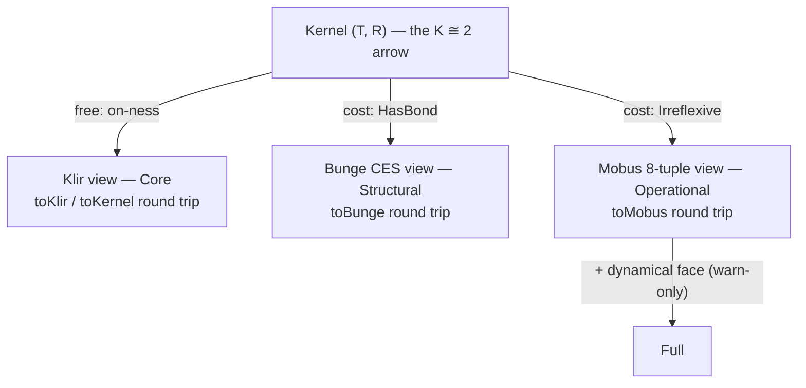

# Lens-entry spec: the mechanical Lean↔Rust binding

Entering a model *as* a lens (mode) is licensed by a precondition. Those
preconditions are proved in `systems-science-foundations` (SSF), and enforced in
`bert-core`. This document is the chain of custody between the two: which Lean
declaration each Rust gate mirrors, and the CI mechanism that makes drift
between them a build failure rather than a matter of trust.

Rung 1 of the escalation ladder (bert-lenses#24). Rungs 1.5+ (a subprocess or
embedded Lean oracle, then a Rust→Lean extraction theorem) are out of scope
here; this rung is the falsifiability floor they regress against.

## A. The view-generation result

`SSF/Systems/Klir/ViewGeneration.lean` proves that one kernel generates each
tradition's presentation as a faithful view. The kernel is Klir's `(T, R)` plus
the walking arrow — `R` depends on `T`:

```
structure Kernel (α) where
  things : Set α            -- T: the relata
  dep    : Set (α × α)      -- R: the dependency relation
  dep_on : ∀ p ∈ dep, p.1 ∈ things ∧ p.2 ∈ things   -- the K ≅ 2 arrow
```

Each view is generated from the kernel, and projects back to it unchanged
(round trip), and distinct kernels generate distinct views (faithfulness). What
differs between views is the *precondition* each charges the kernel:



- **Klir / Core** is free: `Kernel.toKlir` and `KlirSystem.toKernel` round-trip
  with no hypothesis. On-ness (`dep_on`) is the only charge, and it is what
  makes a kernel a system rather than a pair of sets.
- **Bunge / Structural** costs `Kernel.HasBond`: the kernel must contain a
  bonded pair of distinct relata (Def 1.1 — an unbonded collection is an
  aggregate, not a system).
- **Mobus / Operational** costs `Kernel.Irreflexive`: no thing depends on itself
  (§4.3, k ≠ o — self-dependency is not representable in the 8-tuple).

## B. Gate ordering is per-lens licensing, not a tower

The modes are **parallel lenses on a partial order, not a cumulative stack.**
`Structural` (Bunge) and `Operational` (Mobus) each impose their own
precondition independently — neither inherits the other's. They share only
`Core`'s on-ness. `Full` is the one genuine extension: it is `Operational` plus
a populated dynamical face, and that extra check only *warns* (Full is the
default view), so it never blocks entry. The meet-semilattice is tree-shaped
with `Core` at the bottom; there is no join of `Structural` and `Operational`.

Consequently a model can be enterable as `Operational` but not `Structural`
(irreflexive, no bond), or as `Structural` but not `Operational` (bonded, but
carrying a self-loop). The truth table exhibits both.

## C. Precondition → gate mapping

Each row is one precondition: its Lean identifier, plain statement, the Rust
gate function that mirrors it, the mode column it licenses, and a
barely-passing / barely-failing fixture pair that pins exactly what the
predicate means at its boundary.

| Precondition | Lean (`ViewGeneration.lean`) | Plain statement | Rust gate (`bert-core`) | Mode column | Barely passes | Barely fails |
|---|---|---|---|---|---|---|
| On-ness | `Kernel.dep_on` / `toKlir` (free) | every dependency endpoint is a thing | `validate::check_interaction_references` (via `validate_mode` Core) | `core` | holds by construction for every enumerated row | (unrepresentable here: `dep_on` is total) |
| Bond | `Kernel.HasBond` | the dependency has a distinct, bonded pair | `validate::check_bond` (via `validate_mode` Structural) | `structural` | `n=2, dep=[[0,1]]` | `n=2, dep=[[0,0]]` — an edge exists but it is reflexive, so no *distinct* pair |
| Irreflexivity | `Kernel.Irreflexive` | no thing depends on itself | `validate::check_self_loops` (via `validate_mode` Operational/Full) | `operational`, `full` | `n=2, dep=[[0,1]]` | `n=1, dep=[[0,0]]` — the lone edge is a self-loop |

The boundary pairs are the intellectual core: `dep=[[0,0]]` is the row that
forces `HasBond` and `Irreflexive` apart. It has an edge (so it is not empty),
but that edge is reflexive — so it fails `HasBond` (no *distinct* pair) and fails
`Irreflexive` (a self-loop) at once, while `dep=[[0,1]]` passes both.

### The ActsOn pinning

`Kernel.HasBond` is semantic — it needs `Bonded`, hence an `ActsOn` instance.
`check_bond` is syntactic: any interaction between two distinct systems counts.
The two agree exactly under the **total action instance**, where every distinct
pair is bonded, so `HasBond` collapses to "the dependency contains a distinct
pair" — precisely what `check_bond` computes. The fixture is generated against
that instance, and the collapse is *proved*, not asserted, by
`GatesTruthTable.hasBondB_iff`. This is the same pinning recorded in
`bert-core::transition`'s correspondence table.

## D. Vectors and CI

- **Vectors** — `fixtures/gates_truth_table.json`. The SSF module
  `Systems/Klir/GatesTruthTable.lean` enumerates every `(T, R)` kernel over
  `Fin n` for `n ≤ 2` (19 rows — every boundary case: empty, self-loop-only, one
  distinct edge, and their combinations), evaluates the two gate booleans on
  each, and emits the verdicts. The gate booleans are anchored to the real
  ViewGeneration predicates by `hasBondB_iff` / `irreflexiveB_iff`, so the rows
  report the predicates the proofs are about, not a look-alike. Regenerate with
  the command in the fixture's `_generator.command` field:

  ```
  # from the SSF repo root
  lake env lean --run Systems/Klir/GatesTruthTable.lean \
    > ../bert-lenses/fixtures/gates_truth_table.json
  ```

  The Lean side runs offline; no Lean toolchain is needed in Rust CI.

- **Consumption** — `crates/bert-core/tests/gates_truth_table.rs`
  (`rust_gates_agree_with_lean_verdicts_on_every_row`, on the standard
  `cargo test --workspace` CI job). It rebuilds each row as a `WorldModel` and
  asserts `validate_mode`'s entry verdict for each of the four modes equals the
  Lean verdict, in both directions. A Rust gate that starts admitting a model
  Lean refuses (or refusing one Lean admits) turns the test red, naming the row
  and mode:

  ```
  row n=1 dep=[(0, 0)]: Rust admits Operational = false, Lean verdict = true
    — a gate has drifted from its Lean precondition
  ```

This answers the credential-transfer objection in writing: the mode stamp is not
decorative relative to the proof object, because a committed, machine-checked
set of verdicts stands between the Rust gates and any silent drift.
