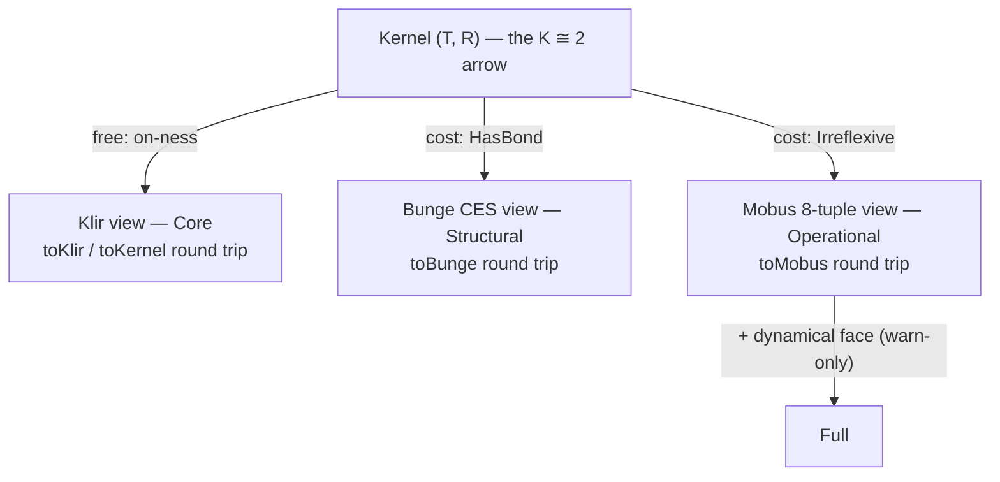

# Lens-entry spec: the mechanical Lean↔Rust binding

Entering a model *as* a lens (mode) is licensed by a precondition. Those
preconditions are proved in `systems-science-foundations` (SSF), and enforced in
`bert-core`. This document is the chain of custody between the two: which Lean
declaration each Rust gate mirrors, and the CI mechanism that makes drift
between them a build failure rather than a matter of trust.

Rungs 1 and 1.5 of the escalation ladder (bert-lenses#24) are shipped and
documented here: the committed truth-table fixture (§D) is the falsifiability
floor, and the subprocess oracle (§D) removes its enumeration bound at test
time. The remaining rungs — an embedded oracle and a Rust→Lean extraction
theorem — are status-tracked in §E, with the recorded decision rule for each.

## A. The view-generation result

`SSF/Systems/Klir/ViewGeneration.lean` proves that one kernel generates each
tradition's presentation as a faithful view. The kernel is Klir's `(T, R)` plus
the walking arrow — `R` depends on `T`:

```
structure Kernel (α) where
  things : Set α            -- T: the relata
  dep    : Set (α × α)      -- R: the dependency relation
  dep_on : ∀ p ∈ dep, p.1 ∈ things ∧ p.2 ∈ things   -- the K ≅ 2 arrow
```

Each view is generated from the kernel, and projects back to it unchanged
(round trip), and distinct kernels generate distinct views (faithfulness). What
differs between views is the *precondition* each charges the kernel:



- **Klir / Core** is free: `Kernel.toKlir` and `KlirSystem.toKernel` round-trip
  with no hypothesis. On-ness (`dep_on`) is the only charge, and it is what
  makes a kernel a system rather than a pair of sets.
- **Bunge / Structural** costs `Kernel.HasBond`: the kernel must contain a
  bonded pair of distinct relata (Def 1.1 — an unbonded collection is an
  aggregate, not a system).
- **Mobus / Operational** costs `Kernel.Irreflexive`: no thing depends on itself
  (§4.3, k ≠ o — self-dependency is not representable in the 8-tuple).

## B. Gate ordering is per-lens licensing, not a tower

The modes are **parallel lenses on a partial order, not a cumulative stack.**
`Structural` (Bunge) and `Operational` (Mobus) each impose their own
precondition independently — neither inherits the other's. They share only
`Core`'s on-ness. `Full` is the one genuine extension: it is `Operational` plus
a populated dynamical face, and that extra check only *warns* (Full is the
default view), so it never blocks entry. The meet-semilattice is tree-shaped
with `Core` at the bottom; there is no join of `Structural` and `Operational`.

Consequently a model can be enterable as `Operational` but not `Structural`
(irreflexive, no bond), or as `Structural` but not `Operational` (bonded, but
carrying a self-loop). The truth table exhibits both.

## C. Precondition → gate mapping

Each row is one precondition: its Lean identifier, plain statement, the Rust
gate function that mirrors it, the mode column it licenses, and a
barely-passing / barely-failing fixture pair that pins exactly what the
predicate means at its boundary.

| Precondition | Lean (`ViewGeneration.lean`) | Plain statement | Rust gate (`bert-core`) | Mode column | Barely passes | Barely fails |
|---|---|---|---|---|---|---|
| On-ness | `Kernel.dep_on` / `toKlir` (free) | every dependency endpoint is a thing | `validate::check_interaction_references` (via `validate_mode` Core) | `core` | holds by construction for every enumerated row | (unrepresentable here: `dep_on` is total) |
| Bond | `Kernel.HasBond` | the dependency has a distinct, bonded pair | `validate::check_bond` (via `validate_mode` Structural) | `structural` | `n=2, dep=[[0,1]]` | `n=2, dep=[[0,0]]` — an edge exists but it is reflexive, so no *distinct* pair |
| Irreflexivity | `Kernel.Irreflexive` | no thing depends on itself | `validate::check_self_loops` (via `validate_mode` Operational/Full) | `operational`, `full` | `n=2, dep=[[0,1]]` | `n=1, dep=[[0,0]]` — the lone edge is a self-loop |

The boundary pairs are the intellectual core: `dep=[[0,0]]` is the row that
forces `HasBond` and `Irreflexive` apart. It has an edge (so it is not empty),
but that edge is reflexive — so it fails `HasBond` (no *distinct* pair) and fails
`Irreflexive` (a self-loop) at once, while `dep=[[0,1]]` passes both.

### The ActsOn pinning

`Kernel.HasBond` is semantic — it needs `Bonded`, hence an `ActsOn` instance.
`check_bond` is syntactic: any interaction between two distinct systems counts.
The two agree exactly under the **total action instance**, where every distinct
pair is bonded, so `HasBond` collapses to "the dependency contains a distinct
pair" — precisely what `check_bond` computes. The fixture is generated against
that instance, and the collapse is *proved*, not asserted, by
`GatesTruthTable.hasBondB_iff`. This is the same pinning recorded in
`bert-core::transition`'s correspondence table.

## D. Vectors and CI

- **Vectors** — `fixtures/gates_truth_table.json`. The SSF module
  `Systems/Klir/GatesTruthTable.lean` enumerates every `(T, R)` kernel over
  `Fin n` for `n ≤ 2` (19 rows — every boundary case: empty, self-loop-only, one
  distinct edge, and their combinations), evaluates the two gate booleans on
  each, and emits the verdicts. The gate booleans are anchored to the real
  ViewGeneration predicates by `hasBondB_iff` / `irreflexiveB_iff`, so the rows
  report the predicates the proofs are about, not a look-alike. Regenerate with
  the command in the fixture's `_generator.command` field:

  ```
  # from the SSF repo root
  lake env lean --run Systems/Klir/GatesTruthTable.lean \
    > ../bert-lenses/fixtures/gates_truth_table.json
  ```

  The Lean side runs offline; no Lean toolchain is needed in Rust CI. The SSF
  commit the committed fixture (and every Lean citation in this document) refers
  to is pinned in `docs/lean-provenance.md`, which also carries the audit path;
  regenerating the fixture and moving that pin are one atomic change (its
  "Update discipline" section).

- **Consumption** — `crates/bert-core/tests/gates_truth_table.rs`
  (`rust_gates_agree_with_lean_verdicts_on_every_row`, on the standard
  `cargo test --workspace` CI job). It rebuilds each row as a `WorldModel` and
  asserts `validate_mode`'s entry verdict for each of the four modes equals the
  Lean verdict, in both directions. A Rust gate that starts admitting a model
  Lean refuses (or refusing one Lean admits) turns the test red, naming the row
  and mode:

  ```
  row n=1 dep=[(0, 0)]: Rust admits Operational = false, Lean verdict = true
    — a gate has drifted from its Lean precondition
  ```

- **Oracle (rung 1.5)** — `crates/bert-core/tests/gates_oracle.rs`
  (`rust_gates_agree_with_lean_oracle_beyond_the_fixture_bound`). The fixture
  can only disagree on a row someone thought to enumerate; this test removes
  the bound. It generates a fixed-seed corpus of `(T, R)` kernels past `n = 2`
  (pinned boundary cases plus random subsets at `n = 3, 4, 5`), shells out to
  the SSF executable `lake exe gates-oracle` — which evaluates the SAME
  `hasBondB` / `irreflexiveB` declarations the fixture enumerator uses — and
  asserts `validate_mode`'s verdict equals the oracle's for every mode on every
  model. Zero FFI: JSON over a pipe (contract documented at the head of
  `SSF/Systems/Klir/GatesOracle.lean`), sidestepping Lean's officially unstable
  C ABI. The test is **Lean-optional**: with no oracle found it prints how to
  enable one (`GATES_ORACLE=<binary>` or `SSF_DIR=<repo>`) and passes as a
  no-op, so the Rust-only CI job keeps running rung 1 without a Lean toolchain.

This answers the credential-transfer objection in writing: the mode stamp is not
decorative relative to the proof object, because a committed, machine-checked
set of verdicts stands between the Rust gates and any silent drift.

## E. Escalation-ladder status

The binding is a staged program (bert-lenses#24 comments, 2026-07-11 research).
Status of each rung, with the recorded decision rule where one gates it:

| Rung | Artifact | Status |
|---|---|---|
| 1 — vectors | `fixtures/gates_truth_table.json` + `gates_truth_table.rs` in CI | **Shipped** 2026-07-20 (§D) |
| 1.5 — subprocess oracle | `gates-oracle` (SSF) + `gates_oracle.rs`, Lean-optional | **Shipped** 2026-07-20 (§D) |
| 2 — embedded oracle | `lean-rs` (or similar) embedding the Lean runtime | **Not adopted** — decision rule is "only if oracle latency bites". Measured 2026-07-21: the full 365-model corpus is one batched subprocess call, ~30 ms of oracle process time, 0.29 s total test wall time. Latency does not bite; re-measure only if call volume grows orders of magnitude (e.g. per-model property tests replacing the batched corpus). |
| 3 — extraction theorem | Aeneas-translated Rust gates + `extracted_gate ⟺ named_precondition` proved in Lean | **Not started** — the recorded end state. Open decisions before work begins: where the extracted Lean artifacts and theorems live (SSF vs a Lake package in this repo), and the toolchain pins (Charon/Aeneas/Lean drift is the pipeline's documented failure mode — pin hard). Our gates are pure predicates over `(T, R)`, exactly the fragment Aeneas handles. |

Rung 2 is a performance escape hatch, not a fidelity upgrade — rungs 1/1.5
already give two-sided falsifiability. Rung 3 is the fidelity upgrade: it would
retire the hand-mirroring in §C's mapping table by making the shipped Rust the
proved object.

The provenance complement to this ladder (bert-lenses#128): which SSF commit
the shipped artifacts refer to, the full claim→theorem map beyond the gate
predicates, and the from-this-repo-alone audit commands live in
`docs/lean-provenance.md`. The split is exactly the extraction-vs-provenance
seam: this document owns how the artifacts are produced and consumed; that one
owns which proofs, where, at what pin.
